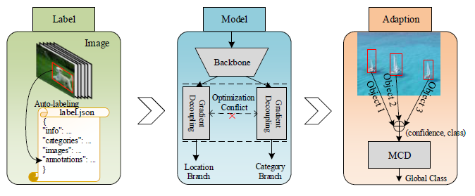
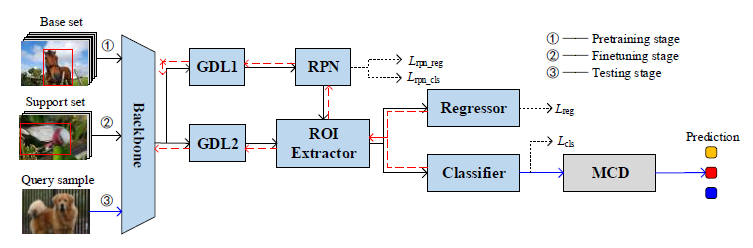

## Introduction

This repository serves as the official source code for the paper titled "*Explicit Location-Label-Guided Foreground Feature Optimization Learning for Few-Shot Classification*"

The source code will be made publicly available upon publication at https://github.com/hrdwsong/CBYD/tree/main.

<div align="center"></div>
<div align="center"></div>

## Quick Start

**1. Check Requirements**
* Linux with Python == 3.8
* PyTorch == 2.3.0 & torchvision == 0.18.1
* CUDA 12.1.0
* GCC == 9.4.0
**2. Build CBYD**
* Clone Code
  ```angular2html
  git clone https://github.com/hrdwsong/CBYD
  cd CBYD
  ```
* Create a virtual environment
  ```angular2html
  conda create -n cbyd python=3.8
  conda activate cbyd
  ```
* Install PyTorch 2.3.0 with CUDA 12.1 
  ```shell
  conda install pytorch==2.3.1 torchvision==0.18.1 torchaudio==2.3.1 pytorch-cuda=12.1 -c pytorch -c nvidia
  ```
* Install Detectron2
  ```shell
  cd ..
  git clone https://github.com/facebookresearch/detectron2.git
  cd detectron2
  git checkout v0.3
  python -m pip install -e .
  ```
* Install other requirements. 
  ```angular2html
  cd ../CBYD_Source
  pip install -r requirements.txt
  ```

**3. Prepare Data and Weights**
* Data Preparation
  - We evaluate our models on five datasets:

    |                              Dataset                               |  Size   | 
    |:------------------------------------------------------------------:|:-------:|
    |  [mini-ImageNet](https://aistudio.baidu.com/datasetdetail/105646)  | 2.88GB  |
    | [tiered-ImageNet](https://aistudio.baidu.com/datasetdetail/201309) | 28.2GB  |
    |    [CUB](https://www.vision.caltech.edu/datasets/cub_200_2011/)    | 1.16GB  |
    | [Stanford Dogs](http://vision.stanford.edu/aditya86/ImageNetDogs/) | 0.753GB |
    |                         [Stanford Cars](http://ai.stanford.edu/~jkrause/cars/car_dataset.html)                          | 1.85GB  |
- Unzip the downloaded datasets and copy all images into `datasets/datasets/miniIN-coco/miniImageNet-coco/data/`(eg. mini-ImageNet):
  ```angular2html
    CBYD_Source
    ...
        | -- configs
        | -- datasets
                | -- datasets
                | -- miniIN-coco
                        | -- miniImageNet-coco
                                | -- data
                                        | -- *.jpg
                        | -- miniImageNet-split
                | -- tieredImageNet
                | -- CUB
                | -- Dogs
                | -- Cars
        | -- defrcn
        | -- tools
    ...
  ```
* Weights Preparation
  - We use the imagenet pretrain weights to initialize our model. Download the same models from here: [GoogleDrive](https://drive.google.com/file/d/1rsE20_fSkYeIhFaNU04rBfEDkMENLibj/view?usp=sharing) [BaiduYun](https://pan.baidu.com/s/1IfxFq15LVUI3iIMGFT8slw)
  - The extract code for all BaiduYun link is **0000**
  - The pretrained weights are completely align with [DeFRCN](https://github.com/er-muyue/DeFRCN)

**4. Training and Evaluation**

For ease of training and evaluation over multiple runs, we integrate the whole pipeline of few-shot classification into one script `*.sh`, including base pre-training and novel-finetuning.
* To reproduce the results on mini-ImageNet, `EXP_NAME` can be any string (e.g cbyd, or something):
  ```angular2html
  miniin_train.sh EXP_NAME
  ```
* Please read the details of pipeline in `*.sh`, you need change `IMAGENET_PRETRAIN*` to your path.

## Results on multiple Benchmarks

| Dataset         | CBYD 5-way 1-shot | CBYD 5-way 5-shot | CBYD++ 5-way 1-shot | CBYD++ 5-way 5-shot | 
|:----------------|:------------------|:-----------------:|:-------------------:|:-------------------:| 
| mini-ImageNet   | 68.85±1.15        |    84.45±0.84     |     85.63±0.99      |     94.80±0.47      | 
| tiered-ImageNet | 74.53±1.02        |    89.50±0.91     |     90.13±0.71      |     95.67±0.51      | 
| CUB             | 83.27±1.82        |    94.39±0.61     |     92.03±0.93      |     97.73±0.45      | 
| Stanford Dogs   | 78.13±1.35        |    88.93±0.89     |     87.49±1.02      |     94.72±0.71      | 
| Stanford Cars   | 90.48±1.19        |    96.64±0.58     |     90.40±0.87      |     96.29±0.59      | 


## Acknowledgement
This repo is developed based on [DeFRCN](https://github.com/ucbdrive/few-shot-object-detection) and [Detectron2](https://github.com/facebookresearch/detectron2). Please check them for more details and features.


